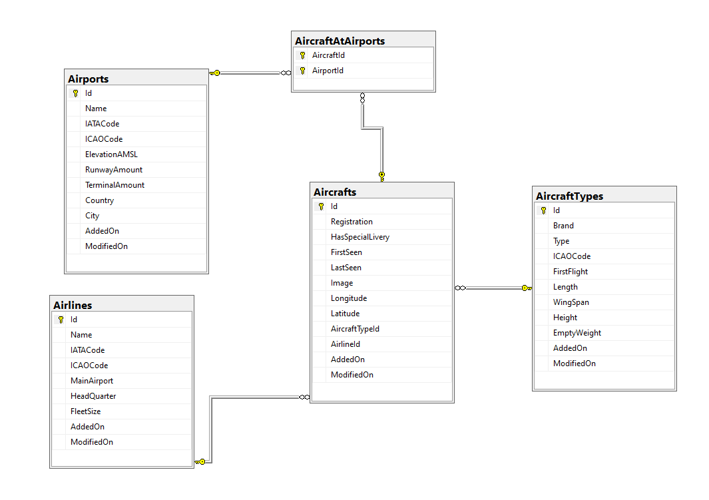

# IMI projectvoorstel PRI
## Jonas Lampaert
### Concept

Ik wil een applicatie maken waarmee een vliegtuigspotter een collectie van vliegtuigen kan aanmaken. Op die manier kan hij snel en gemakkelijk kijken welke vliegtuigen hij in zijn collectie heeft.

Concreet moet het mogelijk zijn om luchthavens, vliegtuigtypes, luchtvaartmaatschappijen en vliegtuigen toe te voegen en die in een lijst weer te geven. Als je op een entiteit klikt, krijg je een pagina met alle relevante informatie over die entiteit. Bijvoorbeeld: als ik op een vliegtuig klik, dan zie ik;
- Een foto
- het registratienummer
- het vliegtuigtype
- de luchtvaartmaatschappij die eigenaar is van het vliegtuig
- een lijst van luchthavens waar ik dit vliegtuig heb gespot
- de datum waarop ik hem voor het eerst heb gespot
- de datum waarop ik hem voor het laatst heb gespot
- of het vliegtuig een speciale [livery](http://dictionary.sensagent.com/Aircraft%20livery/en-en/#:~:text=Aircraft%20livery%20is%20a%20paint%20scheme%20applied%20to%20an%20aircraft%2C%20generally%20to%20fuselage%2C%20wings%2C%20empennage%20(tail%20fin)%2C%20or%20jet%20engines.%20The%20term%20aircraft%20livery%20comes%20from%20the%20more%20general%20term%20livery.) had, ja of nee.

Ik kan deze informatie ook aanpassen en een admin kan zelfs info verwijderen. Luchthavens, maatschappijen en vliegtuigtypes kunnen enkel verwijderd worden als er geen enkel vliegtuig aan gekoppeld is.

Verder is het mogelijk om te filteren op registratie, vliegtuigtype, luchthaven, maatschappij en op livery. Ik krijg dan een lijst te zien van alle vliegtuigen die aan deze filters voldoen. Als ik een speciefiek vliegtuig zoek, dan kan ik zijn registratienummer ingeven in een zoekbalk.

### Nice to have's
Statistieken weergeven

### Voorbeeld
Jef gaat voor het eerst gaan spotten in Brussels Airport. Als hij aankomt doet hij de app open en gaat hij naar het tabblad luchthavens. Daar ziet hij een lijst met luchthavens waar hij al geweest is. In zijn geval is dit enkel Oostende. Aangezien Brussels airport er nog niet tussen staat, voegt hij deze toe aan de app.

Een beetje later spot hij een Airbus A320 van Brussels Airlines. Aangezien dit de eerste keer is dat hij een A320 spot, voegt hij de A320 toe aan de lijst van vliegtuigtypes onder het tabblad vliegtuigtypes. Hij voegt ook Brussels Airlines toe aan de lijst van luchtvaarmaatschappijen. Als laatste moet hij nu nog het vliegtuig zelf toevoegen.

Jef gaat nu naar het tabblad vliegtuigen. Hier ziet hij een lijst van vliegtuigen die hij al gespot heeft. Tot nu toe is dit een Boeing 737 TUI fly en een airbus A330 van EgyptAir Cargo. Hij klikt nu op de knop om een nieuw vliegtuig toe te voegen. Hij krijgt een formulier waar hij alle info over dat vliegtuig kan toevoegen. In het veld luchhaven krijgt hij een lijst met luchthavens die in de app zijn toegevoegd, hieruit kan hij dan één of meerdere luchthavens selecteren, hetzelfde geld voor vliegtuigtype en maatschappij. Van de twee laatste kan hij slechts één selecteren.

Als Jef ziet dat de info fout is of hij heeft datzelfde vliegtuig nog eens gespot, dan kan hij de info van dat vliegtuig aanpassen.

Als Jef wil controleren hoeveel vliegtuigen van Brussels Airlines er in zijn collectie zitten, dan kan hij filteren op Brussels Airlines. Hij krijgt dan een lijst te zien van alle vliegtuigen van Brussels Airlines die hij aan de app heeft toegevoegd. Als hij dan zegt dat hij enkel de A320's van Brussels Airlines wil zien, dan kan hij een filter op Airbus A320 toevoegen en ziet hij enkel de A320's van Brussels Airlines die in de app zitten.

Als hij bijvoorbeeld wil controleren of hij het vliegtuig van de rode duivels als in zijn collectie heeft, dan kan hij het registratienummer van dat vliegtuig ingeven. Als hij het al heeft dan zal zit vliegtuig verschijnen, als hij het nog niet heeft dan zal er een bericht verschijnen dat dit vliegtuig nog niet in de app zit.

### Technische info

| Controller   | GET (Restricted) | POST (Restricted) | PUT (Restricted) | DELETE (Restricted) |
| :---         |    :----:        |    :----:         |    :----:        |        :---:        |
| Airport      | Ja               | Ja                | Ja               | Admin only*          |
| AircraftType | Ja               | Ja                | Ja               | Admin only*          |
| Airline      | Ja               | Ja                | Ja               | Admin only*          |
| Aircraft     | Ja               | Ja                | Ja               | Admin only*          |

*Enkel als er geen relaties zijn\

### Endpoints
#### Aircrafts

| Methode      |      Endpoint         |         WPF       |     Admin only   |
| :---         |    :----:             |    :----:         |    :----:        |
| GET          | /api/aircrafts        | Ja                | Nee              |
| GET          | /api/aircrafts/id     | Ja                | Nee              |
| POST         | /api/aircrafts        | Ja                | Nee              |
| PUT          | /api/aircrafts        | Ja                | Nee              |
| DELETE       | /api/aircrafts/id     | Ja                | Ja               | 

#### Airports

| Methode      |      Endpoint         |         WPF       |     Admin only   |
| :---         |    :----:             |    :----:         |    :----:        |
| GET          | /api/airports         | Ja                | Nee              |
| GET          | /api/airports/id      | Nee               | Nee              |
| POST         | /api/airports         | Nee               | Nee              |
| PUT          | /api/airports         | Nee               | Nee              |
| DELETE       | /api/airports/id      | Nee               | Ja               |

#### AircraftTypes

| Methode      |      Endpoint         |         WPF       |     Admin only   |
| :---         |    :----:             |    :----:         |    :----:        |
| GET          | /api/aircrafttypes    | Ja                | Nee              |
| GET          | /api/aircrafttypes/id | Nee               | Nee              |
| POST         | /api/aircrafttypes    | Nee               | Nee              |
| PUT          | /api/aircrafttypes    | Nee               | Nee              |
| DELETE       | /api/aircrafttypes/id | Nee               | Ja               |

#### Airlines

| Methode      |      Endpoint         |         WPF       |     Admin only   |
| :---         |    :----:             |    :----:         |    :----:        |
| GET          | /api/airlines         | Ja                | Nee              |
| GET          | /api/airlines/id      | Nee               | Nee              |
| POST         | /api/airlines         | Nee               | Nee              |
| PUT          | /api/airlines         | Nee               | Nee              |
| DELETE       | /api/airlines/id      | Nee               | Ja               |

### Externe API

Aviationstack API (https://aviationstack.com/documentation)\
Cirium flightstats (https://developer.flightstats.com/api-docs/aircraft/v1)

### ERD
 